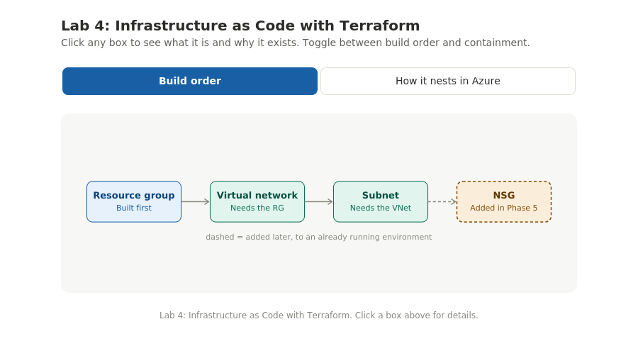
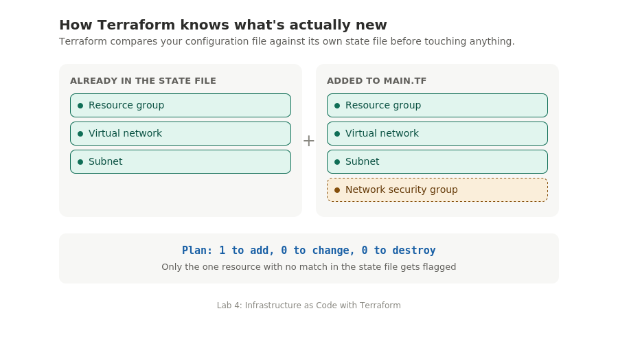
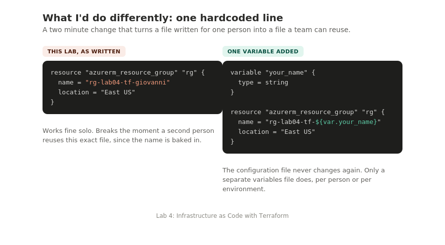

# Lab 4: Infrastructure as Code with Terraform

Terraform | Azure Resource Manager | Azure Cloud Shell | Networking basics

A step by step Azure and Terraform lab, written so a 12 to 13 year old can follow along.

> This is the corrected, plain language version. Every command below is the fixed, working version, not the original with its one factual error left in.

[Watch the walkthrough on Loom](https://www.loom.com/share/2af25a9a10104d1286ff8e1f603b8a36)

[Architecture diagram (interactive)](diagrams/architecture.html). Open in any browser, click a box for details.



## What are we even doing here?

Building something in the Azure website is like assembling furniture by having someone stand over your shoulder telling you which screw to turn next, one at a time. It works, but if you ever need to build the exact same thing again, you're starting from scratch and hoping you remember every step.

Terraform is different. It's like writing out a full LEGO instruction booklet first: "I want a resource group named X, a network inside it, and a smaller slice of that network." Then you hand the booklet to a robot builder and it does the actual assembly. Write the booklet once, and you can hand it to the robot as many times as you want, on any computer, and get the exact same result.

> **What this actually means:**
> - Declarative means you describe what you want, not the steps to get there.
> - Terraform is the robot builder, the tool that reads your instruction booklet and actually creates things in Azure.
> - A resource in Terraform is any single thing it creates. This lab creates four total.

## How Terraform works, read this first

**Terraform describes what, not how.** Clicking through the Azure portal means telling Azure exactly how to build something, one click at a time. Terraform works the opposite way: you write a file that says "I want a resource group called X in East US" and Terraform figures out the steps itself.

**The state file is Terraform's memory.** After Terraform creates something, it writes a file called `terraform.tfstate` into your project folder. Every time you run `plan` or `apply`, Terraform reads this file first to know what already exists, so it only changes what's actually different. Never delete, move, or hand edit it.

**The four commands, always in this order:**

| Command | What it does | When to run it |
|---|---|---|
| `terraform init` | Downloads the Azure plugin | Once per project, the first step |
| `terraform plan` | Previews what will change | Before every apply, never skip |
| `terraform apply` | Builds or updates resources | After you review and approve the plan |
| `terraform destroy` | Removes everything tracked in state | When tearing down a lab |

## Prerequisites

- Active Azure subscription
- Access to the Azure portal at portal.azure.com

> **No installation needed:** this entire lab runs inside Azure Cloud Shell, a browser based terminal built into the Azure portal. Terraform is already installed there.

## Naming conventions

Every resource name includes `[yourname]`. Replace it with your own first name, lowercase, no spaces.

| Resource | Name to use |
|---|---|
| Resource group | `rg-lab04-tf-[yourname]` |
| Virtual network | `vnet-terraform` |
| Subnet | `snet-backend` |
| NSG (Phase 5) | `nsg-web` |
| Location | East US |

## Phase 1: Open Cloud Shell (about 3 minutes)

1. **Log in.** Go to portal.azure.com and sign in.
2. **Open Cloud Shell.** Click the terminal icon in the top right toolbar.
   > First time opening it? A setup panel asks you to configure storage. Select your subscription, leave defaults, click Create. Takes about 60 seconds, one time only.
3. **Select Bash, not PowerShell.** Check the dropdown in the top left of the terminal panel.
4. **Create your project folder:**
   ```bash
   mkdir terraform-lab
   cd terraform-lab
   ```
   Your prompt should now end with `~/terraform-lab$`.

## Phase 2: Write the configuration (about 10 minutes)

**Step 5.** Open the built in code editor, the same Monaco editor that powers VS Code, running in your browser:
```bash
code main.tf
```

**Step 6.** Paste the full configuration below. Before saving, find the line with `rg-lab04-tf-giovanni` and change the name to your own.

```hcl
# 1. Tell Terraform which provider to use
terraform {
  required_providers {
    azurerm = {
      source  = "hashicorp/azurerm"
      version = "~> 3.0"
    }
  }
}

provider "azurerm" {
  features {}
}

# 2. Resource Group
resource "azurerm_resource_group" "rg" {
  name     = "rg-lab04-tf-giovanni" # <-- CHANGE THIS TO YOUR NAME
  location = "East US"
}

# 3. Virtual Network
resource "azurerm_virtual_network" "vnet" {
  name                = "vnet-terraform"
  location            = azurerm_resource_group.rg.location
  resource_group_name = azurerm_resource_group.rg.name
  address_space       = ["10.0.0.0/16"]
}

# 4. Subnet
resource "azurerm_subnet" "subnet" {
  name                 = "snet-backend"
  resource_group_name  = azurerm_resource_group.rg.name
  virtual_network_name = azurerm_virtual_network.vnet.name
  address_prefixes     = ["10.0.1.0/24"]
}
```

**Step 7.** Change the resource group name to your own name.

**Step 8.** Save (`Ctrl+S`), then close (`Ctrl+Q`). Do both, closing without saving loses your changes.

**Step 9.** Confirm it saved:
```bash
cat main.tf
```

## Phase 3: Deploy, the Terraform workflow (about 10 minutes)

```bash
terraform init
```
> Look for: `Terraform has been successfully initialized!`

```bash
terraform plan
```
> Look for: `Plan: 3 to add, 0 to change, 0 to destroy.`
>
> **Never skip plan.** With three resources the output is simple. With dozens of resources, plan is what stops you from accidentally touching something you didn't mean to.

```bash
terraform apply
```
Type the full word `yes` when prompted, not just `y`.
> Look for: `Apply complete! Resources: 3 added, 0 changed, 0 destroyed.`

Terraform has now written `terraform.tfstate` to your project folder. Don't touch it by hand.

## Phase 4: Verify in the Azure portal (about 5 minutes)

1. Minimize Cloud Shell.
2. Search **Resource groups** in the portal, find `rg-lab04-tf-[yourname]`.
3. You should see two resources inside: `vnet-terraform` and the subnet.
4. Click into the VNet, then **Subnets**, and confirm `snet-backend` shows `10.0.1.0/24`.

## Phase 5: The power of IaC, add a resource to a live environment (about 8 minutes)

This phase shows Terraform's most important trait: it only changes what's different.

**Step 15-16.** Reopen the editor and add this block to the bottom of `main.tf`, without touching anything else:
```hcl
# 5. Network Security Group
resource "azurerm_network_security_group" "nsg" {
  name                = "nsg-web"
  location            = azurerm_resource_group.rg.location
  resource_group_name = azurerm_resource_group.rg.name
}
```
Save and close.

**Step 17.**
```bash
terraform plan
```
> Look for: `Plan: 1 to add, 0 to change, 0 to destroy.` Only the NSG, nothing else gets touched.



**Step 18.**
```bash
terraform apply
```
> Look for: `Apply complete! Resources: 1 added, 0 changed, 0 destroyed.`

Refresh your resource group in the portal. You should now see **three** resources inside it: the VNet, the subnet, and `nsg-web`.

> **Fixed from the original draft:** it said "four resources" here but only named three. Three is correct, the resource group is the container these three sit inside, not a fourth item inside itself.

## Phase 6: Destroy, clean up everything (about 5 minutes)

```bash
terraform destroy
```
> Look for: `Plan: 0 to add, 0 to change, 4 to destroy.` Four is correct here, since destroy removes the resource group itself too, not just what's inside it.

Type `yes` when prompted.
> Look for: `Destroy complete! Resources: 4 destroyed.`

**Always use `terraform destroy` instead of deleting in the portal.** If you delete the resource group manually, `terraform.tfstate` still records those resources as existing, and the next `terraform plan` may show errors or try to recreate them. `terraform destroy` keeps your state file and your actual Azure environment in sync.

Verify in the portal that `rg-lab04-tf-[yourname]` no longer appears in the resource group list.

## Troubleshooting

| Problem | Cause | Fix |
|---|---|---|
| "Resource group already exists" | A resource group with this exact name already exists | Change the name in main.tf, or delete the existing one first |
| `terraform: command not found` | Cloud Shell session dropped Terraform | Close and reopen Cloud Shell from the portal toolbar |
| Syntax error on line X | A missing `}`, a missing `"`, or a stray character | Open with `code main.tf`, check the line shown, every `{` needs a matching `}` |
| Plan shows 0 to add | State file already records these resources as existing | Run `terraform destroy` first if you want to start fresh |
| Apply fails partway through | A transient Azure API error or quota limit | Run `terraform apply` again, it skips what's already done |
| Editor doesn't close with Ctrl+Q | Browser intercepts the shortcut | Click the X in the top right of the editor panel instead |

## Knowledge check

- What does `terraform init` download, and why does it need to?
- What's the difference between `terraform plan` and `terraform apply`?
- What is `terraform.tfstate`, and why should you never delete it by hand?
- Why did `terraform plan` show `1 to add`, not 4, when you added the NSG in Phase 5?
- Why use `terraform destroy` instead of deleting resources through the Azure portal?

## What you accomplished

- Wrote a Terraform configuration file describing a resource group, virtual network, and subnet
- Ran the full init, plan, apply workflow and deployed all three resources to Azure
- Added a network security group to a live environment and watched Terraform change only the new resource
- Destroyed the entire environment with a single `terraform destroy` command
- Understood why Infrastructure as Code is the professional standard for managing cloud infrastructure at scale

## Bonus: words worth knowing

| Word | What it means |
|---|---|
| IaC | Infrastructure as Code, writing build instructions as a file instead of clicking through a website |
| Declarative | Describing the end result you want, not the steps to get there |
| Provider | A plugin that teaches Terraform how to talk to a specific cloud (`azurerm` for Azure) |
| State file | Terraform's own record of everything it has built |
| Resource group (RG) | A labeled container grouping related Azure resources so they can be managed together |
| VNet / Subnet | A private network, and a smaller slice carved out of it |
| NSG | Network Security Group, a set of firewall rules |
| CIDR | The `/16`, `/24` notation describing a range of network addresses |
| Idempotent | Running the same instructions again gives the same safe result |

## Bonus: key Terraform ideas worth understanding

| Idea | Why it's there |
|---|---|
| Resource references create automatic ordering | When the VNet's config mentions `azurerm_resource_group.rg.name`, Terraform knows the RG must exist first |
| `required_providers` block | Pins the provider version so the same code behaves the same way on any machine |
| `features {}` on the provider block | Required by `azurerm` even when empty, opts into default behaviors |
| Plan before apply, always | The habit that scales, catches an unintended change before it happens |

## Bonus: how this lab would change for a real company

The first row below is the easiest one to fix yourself. Here's exactly what that change looks like:



| Lab shortcut | Production grade version |
|---|---|
| Resource names typed by hand | Names generated from variables and a naming convention module |
| State kept in Cloud Shell's temporary storage | Remote state in Azure Blob Storage with locking |
| One person runs `terraform apply` manually | A pipeline (GitHub Actions, Azure DevOps) runs it with an approval step |
| A single flat `main.tf` | Configuration split into reusable modules |
| NSG created empty | NSG created with specific, reviewed rules from a shared security baseline |
